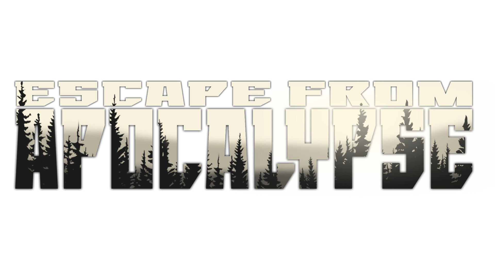
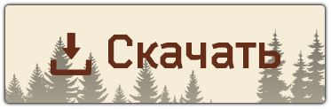
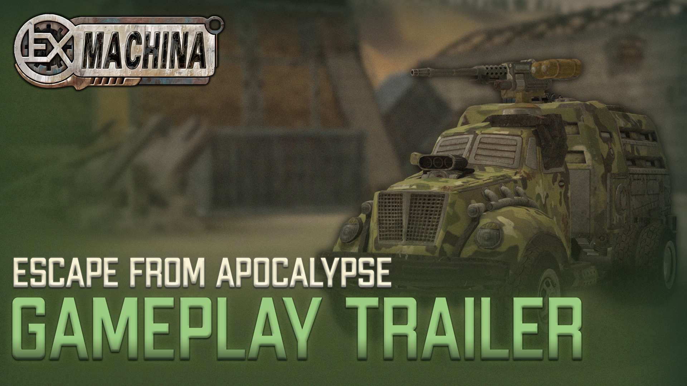
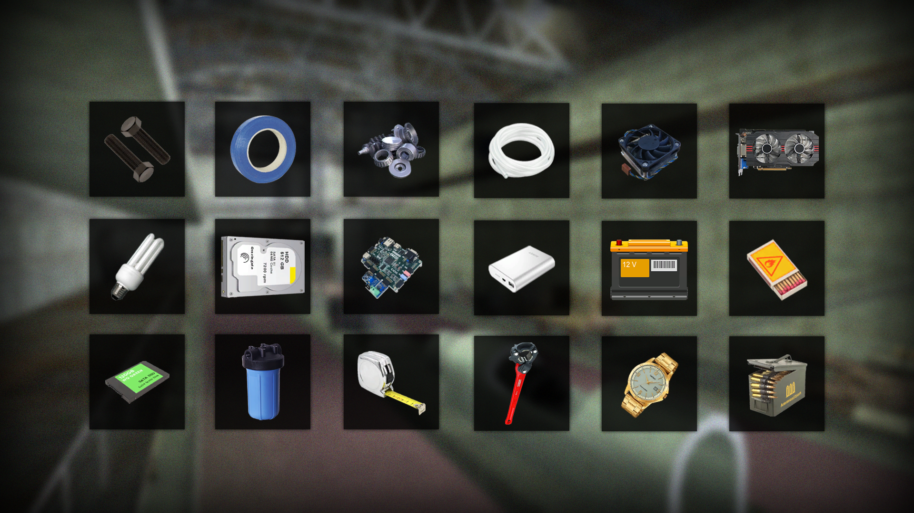
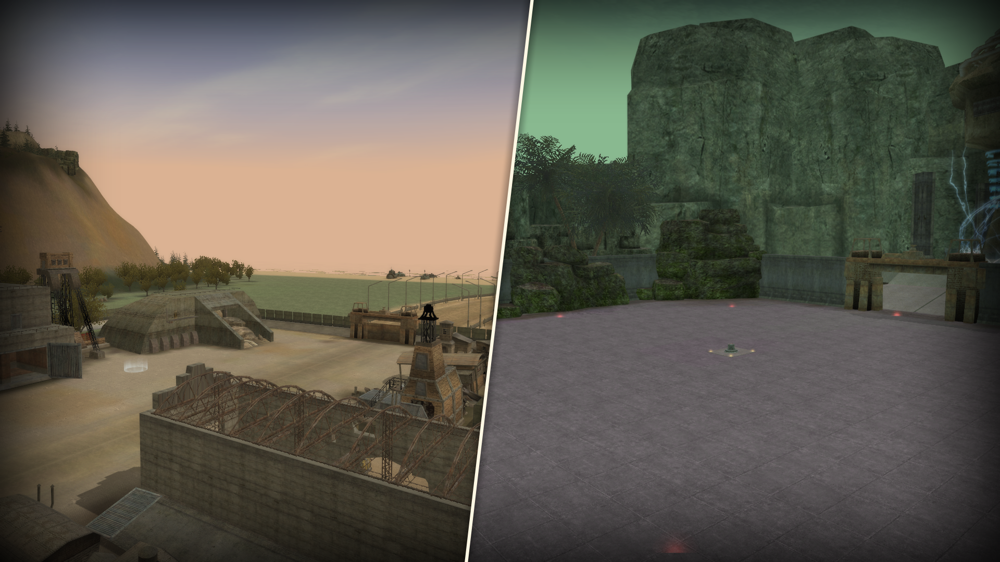
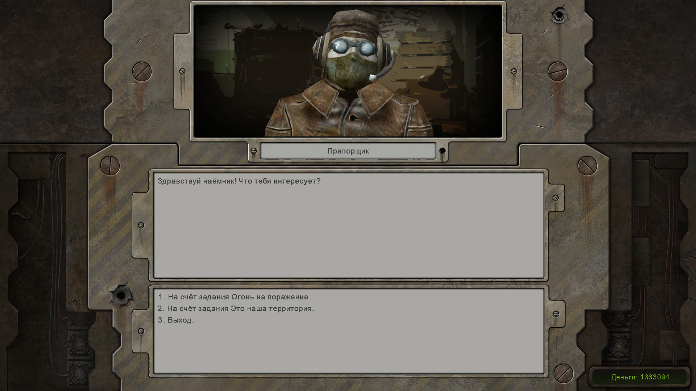

    
    <h2>Escape from Apocalypse</h2>
    
Модификация, целью которой является, перенос всех возможных механик и игрового опыта из Escape from Tarkov в Ex Machina.

    <h4>Найти модификацию можно также на этих ресурсах:</h4>
    

        <a href="https://discord.gg/jZHxYdF">
             Discord сервер DEM
        </a>
     
        <a href="https://forum.deuswiki.com/">
             Форум Deus Wiki
        </a>
  

# Описание

**Escape from Apocalypse** - геймплейная модификация к игре **Ex Machina**, цель которой, перенести возможные механики и игровой опыт из **Escape from Tarkov** в **Ex Machina**.

В этой модификации вас ждёт полностью новый игровой процесс, строительство убежища, новые предметы, механики, локации и квесты. Всё что может повторить игровой процесс из **Escape from Tarkov** есть в этой модификации.

# Основные изменения

1. Полностью измененный игровой процесс, не повторяющий оригинальную игру
2. Добавлены новые локации и изменены старые
3. Механика строительства модулей в убежище
4. Система крафтов
5. Новые предметы
6. Новые квесты
7. Пополнение HP, брони и бензина с помощью восполняющих предметов
8. Ограниченный боезапас вооружения и его пополнение с помощью специальных предметов
9. Множество других механик и взаимодействия с миром

## Другие изменения

+ **Интерфейс:**
    + Изменены/перерисованы некоторые элеметны интерфейса
    + Произведен _Upscale_ некоторых элеметов интерфейса, которые не коснулись в _Community Remaster_
    + Исправлено некоректное отображение текста в интерфейсе
    + Изменена глобальная карта
    + Новое главное меню и экран загрузки

+ **Прототипы:**
    + Добавлен _Крейсер_ в продажу
    + Добавлен спец. слот для кузова _Крейсера (Уровня II)_
    + _Скаут_, _Боец_ и _Охотник_ теперь в качестве играбельных машин
    + Добавлено больше слотов под гаджеты у некоторых прототипов кабин
    + У большинства кузовов изменено расположение слотов вооружения, тем самым увеличив их вместительность
    + Множество других изменений в прототипах

+ **Край:**
    + Добавлены новые строения
    + Добавлены новые вариации погоды
    + В многих местах исправлен _клипинг_ и левитирование объектов
    + Улучшена _passmap_

+ **Убежище:**
    + Новая локация, в которой игрок будет проводить время вне рейдов
    + Возможность постройки **7** модулей убежища
    + Более **50** крафтов предметов
    
+ **Другое:**
    + Новые торговцы
    + Новые группировки
    + Машины, кабины и кузова теперь закрыты за квестами
    + Добавлен игровой процесс за _Дикого_
    + Добавлена карма _Дикого_
    + Множество других изменений и улучшений

 

# Скачать модификацию

#### Для работы модификации требуется установить `Community Remaster v1.14.1` с помощью `Commod v2.2.1`

     
    <b>Актуальная версия:</b>
      
    

# Установка

**Описание установки:**

1. Установить `Community Remaster` со `всеми дополнительными опциями` по инструкции с [этой](https://github.com/DeusExMachinaTeam/EM-CommunityPatch/blob/main/README.md) страницы
2. В `Community Mod Manager (commod.exe)` на вкладке `Моды` нажмите `Добавить мод` и укажите архив, который вы скачали [отсюда]()
3. После его появления в списке модов нажмите `Распаковать`
4. После распаковки нажмите `Установить` и следуйте инструкциям мод-менеджера
5. Приятной игры

## Медиа

**Видео связанные с Escape fromApocalypse:**

 

> 
_Трейлер модификации показывающий новвовидения в игре._

 

> 
_Трейлер игрового процесса, позволяющий ознакомиться с модификацией и получить первое впечатление._

## Скриншоты

 

> 
_Более **150** новых предметов для сбора, начиная от строительных материалов, заканчивая электроникой_.

 

> 
_Новые локации [На скриншоте изображено **Убежище** и **Подземелье** с ипытанием]_.

 

> 
_Диалог с NPC_.

 

>  
_Строительство модулей в **Убежище**_.

 

>  
_Новые квесты, вдохновленные **Escape from Tarkov**_.

 

(<a href="#top">перейти наверх</a>)

## Лицензирование

    
Информация о лицензии

<ol>
 
    Проект распространяется в полном виде только на <b>Github.com</b>, <b>Discord DEM</b> и <b>Форуме Deus Wiki</b>. Распространение файлов на других сайтах посторонними людьми не разрешено.
  
    Исходный код проекта лицензирован под MIT-подобной лицензией (исключая коммерческое использование) и может быть свободно использован как основа для создания ваших собственных модов. Пожалуйста, не забывайте сохранять текст лицензии и ссылку на проект, если используете его части.
  
    Для подробностей, пожалуйста, ознакомьтесь с полным текстом лицензии в файле <i><a href="LICENSE.txt">LICENSE</a></i>.
</ol>

