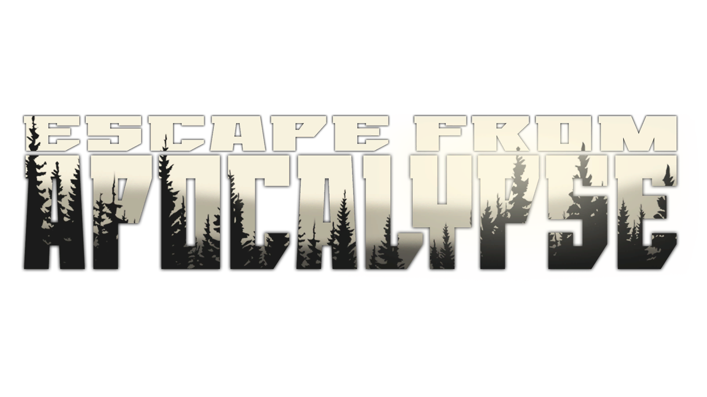
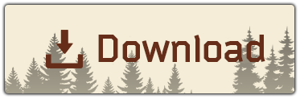
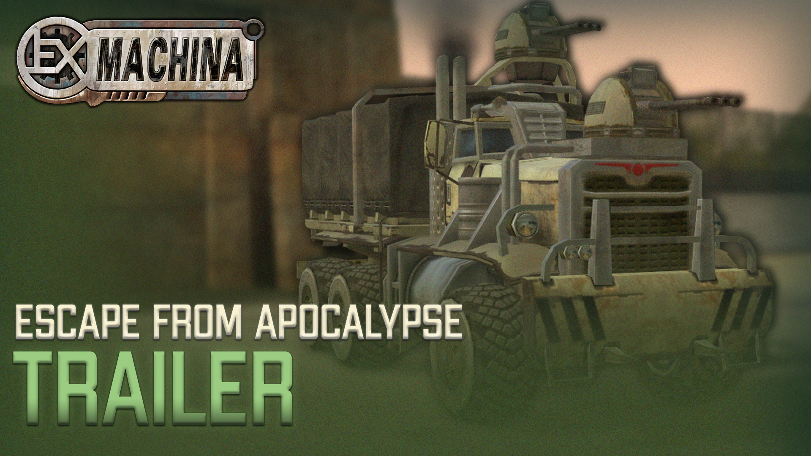
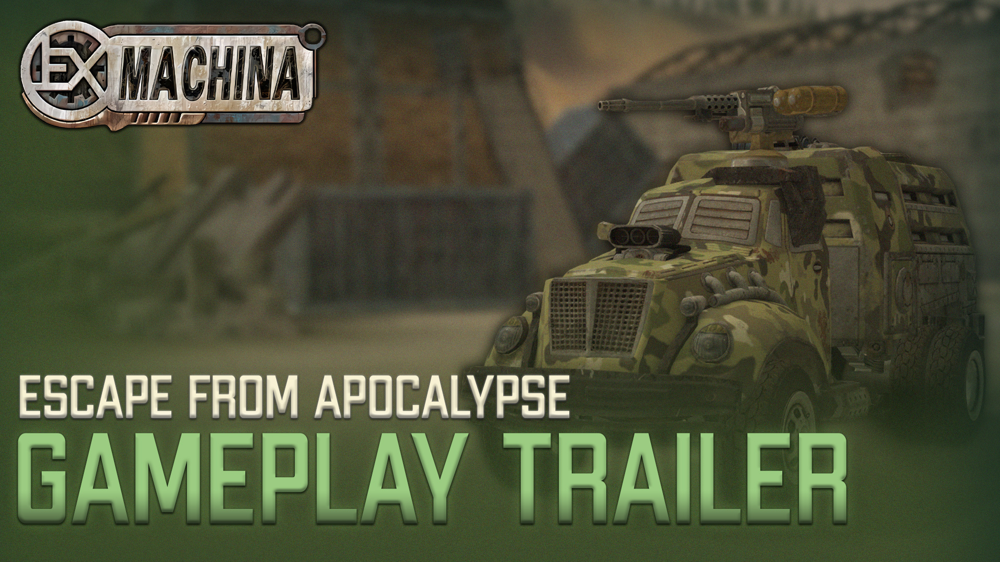
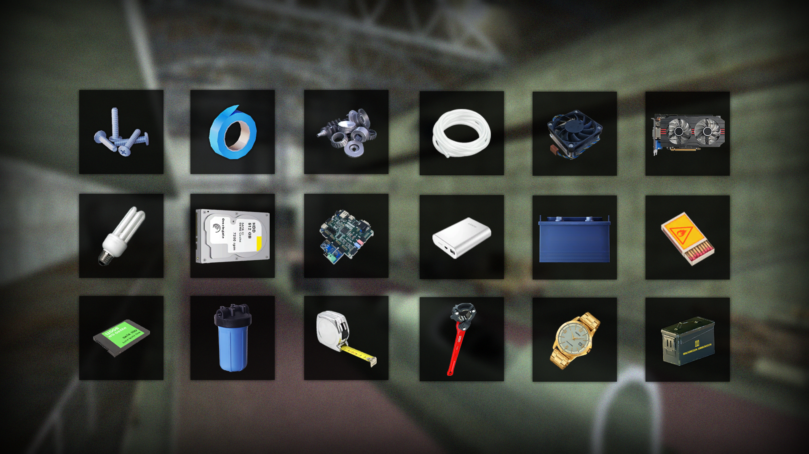
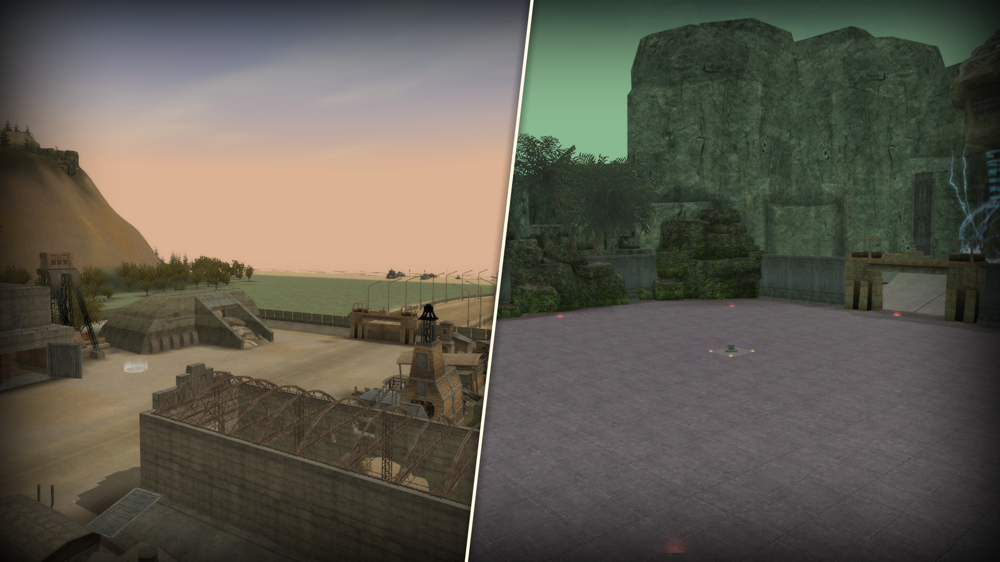
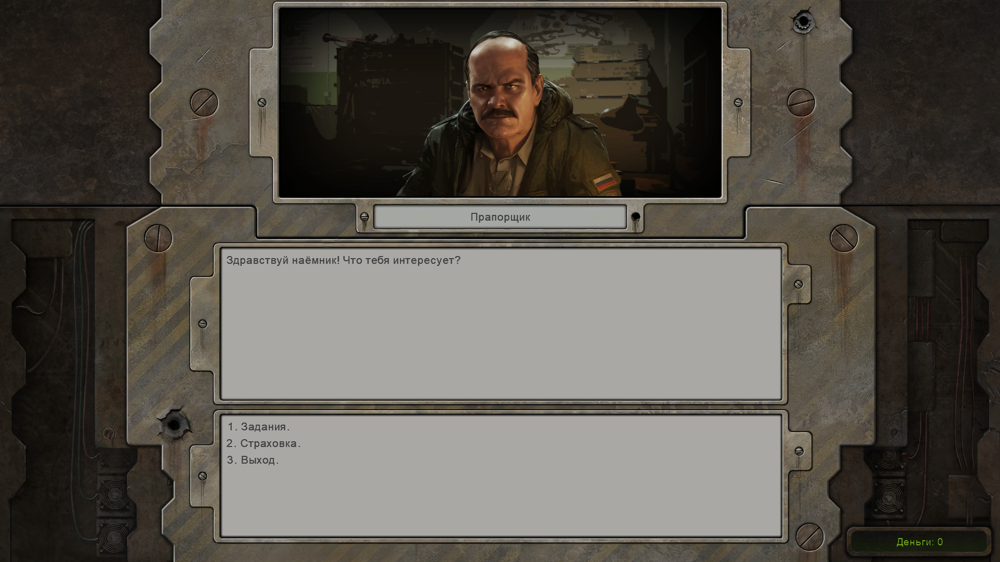

     
    
    
    <h2>Escape from Apocalypse</h2>
    
A modification aimed at transferring all possible mechanics and gaming experience from Escape from Tarkov to Hard Truck Apocalypse.

    <h4>You can also find the modification on these resources:</h4>
    

        <a href="https://discord.gg/jZHxYdF">
             Discord server DEM
        </a>
     
        <a href="https://forum.deuswiki.com/">
             Forum Deus Wiki
        </a>
  

# Description

**Escape from Apocalypse** is a gameplay modification for the game **Hard Truck Apocalypse**, the purpose of which is to transfer possible mechanics and gaming experience from **Escape from Tarkov** to **Hard Truck Apocalypse**.

In this modification you will find a completely new gameplay, shelter construction, new items, mechanics, locations and quests. Everything that can repeat the gameplay from **Escape from Tarkov** is in this modification.

# Main changes

1. Completely new gameplay
2. New locations and old ones changed
3. Building modules in the shelter
4. Crafting system
5. New items
6. New quests
7. Replenish HP, armor, and fuel with replenishing items
8. Limited ammunition for weapons and its replenishment with the help of special items
9. Many other mechanics and interactions with the world

## Other changes

+ **Interface:**
    + Some interface elements have been changed/redrawn
    + Improved the quality of some interface elements that were not touched in the Community Remaster
    + Fixed incorrect display of text in the interface
    + Changed global map
    + New main menu and loading screen

+ **Prototypes:**
    + Added _Cruiser_ for sale
    + Added special slot for body _Cruiser (LVL II)_
    + _Scout_, _Fighter_ and _Hunter_ are now playable vehicles
    + Added more gadget slots to some cabin prototypes
    + Most bodies have had their weapon slots relocated, increasing their capacity
    + Many other changes in prototypes

+ **Krai:**
    + New buildings and roads
    + New weather variations
    + Fixed clipping and levitation of objects in many places
    + Improved passmap

+ **Shelter (A new location where the player will spend time outside of raids):**
    + Possibility to build **9** shelter modules
    + Over **50** craftable items
    
+ **Other:**
    + New traders
    + New fractions
    + Many other changes and improvements

 

# Download

#### To use the modification you need to install `Community Remaster v1.14.1` using `Commod v3.0+`

     
    <b>Latest version:</b>
      
    

# Installation

**Installation description:**

1. Install `Community Remaster` with `all optional content` according to the instructions on [this](https://github.com/DeusExMachinaTeam/EM-CommunityPatch/blob/main/README_EN.md) page
2. In `DEM Community Mod Manager` on the `Local mods` tab press `Add mod` and specify the archive you downloaded from [here](https://github.com/KiraDesuReal/Escape-from-Apocalypse/releases/tag/v0.91-250409)
3. After it appears in the list of mods, click `Extract`
4. After unpacking, click `Install` and follow the instructions of the mod manager
5. Enjoy the game

## Media

**Video on Escape from Apocalypse:**

 

> 
_Trailer of the modification showing innovations in the game_.

 

> 
_Gameplay trailer to give you a first look at the mod and get a first impression_.

## Screenshots

 

> 
_Over **150** new items to collect, from building materials to electronics_.

 

> 
_New Locations [Screenshot shows **Shelter** and **Dungeon** with challenge]_.

 

> 
_Dialogue with NPC_.

 

>  
_Building modules in **Shelter**_.

 

>  
_New quests inspired by **Escape from Tarkov**_.

 

(<a href="#top">go to the top</a>)

## Licensing

    
License information

<ol>
 
    The project is distributed in its complete form only on <b>Github.com</b>, <b>Discord DEM</b> and <b> Forum Deus Wiki</b>. Distribution of files on other sites by third parties is not permitted.
  
    The source code of the project is licensed under an MIT-like license (excluding commercial use) and can be freely used as a basis for creating your own mods. Please remember to keep the license text and a link to the project if you use parts of it.
  
    For details, please see the full license text in the <i><a href="LICENSE.txt">LICENSE</a></i> file.
</ol>

